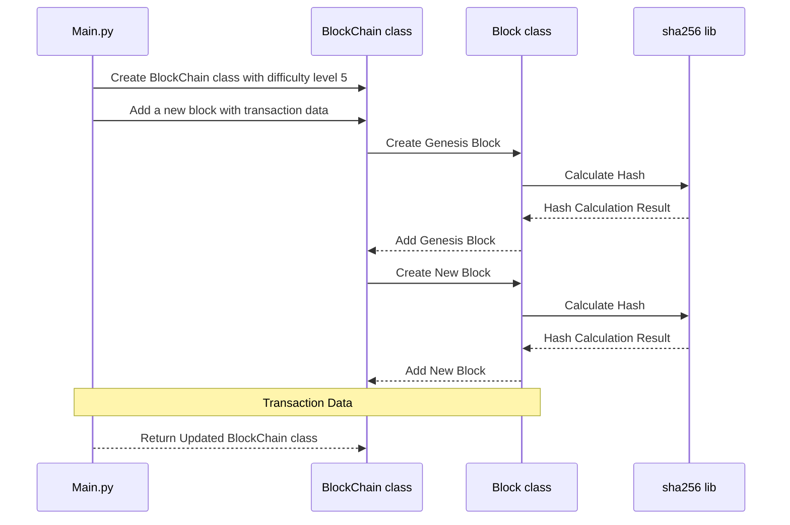

# Blockchain-based-proof-of-transaction-system

## ブロックチェーンの雰囲気実装です。

# sequenceDiagram

```mermaid
sequenceDiagram
    participant Main.py
    participant BlockChain class
    participant Block class
    participant sha256 lib

    Main.py->>BlockChain class: Create BlockChain class with difficulty level 5
    Main.py->>BlockChain class: Add a new block with transaction data

    BlockChain class->>Block class: Create Genesis Block
    Block class->>sha256 lib: Calculate Hash
    sha256 lib-->>Block class: Hash Calculation Result
    Block class-->>BlockChain class: Add Genesis Block

    BlockChain class->>Block class: Create New Block
    Block class->>sha256 lib: Calculate Hash
    sha256 lib-->>Block class: Hash Calculation Result
    Block class-->>BlockChain class: Add New Block

    Note over Main.py,Block class: Transaction Data
    Main.py-->>BlockChain class: Return Updated BlockChain class

```
